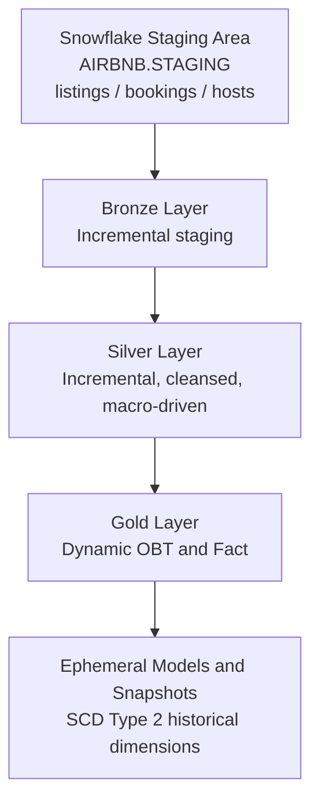

# Airbnb Data Transformation Pipeline
 


 
An end-to-end data transformation pipeline built with **dbt Core** and **Snowflake**. It transforms raw Airbnb domain data across a **Medallion Architecture (Bronze / Silver / Gold)**, using incremental materializations, custom macros, schema routing, and **Slowly Changing Dimensions (SCD Type 2)** via dbt snapshots.
 
---
 
## Table of Contents
 
- [Tech Stack](#tech-stack)
- [Architecture](#architecture)
- [Layer Design](#layer-design)
- [Key Implementation Details](#key-implementation-details)
- [Getting Started](#getting-started)
- [Acknowledgments](#acknowledgments)
---
 
## Tech Stack
 
| Category | Tool |
|---|---|
| Data warehouse | Snowflake |
| Transformation engine | dbt Core (v1.12+) |
| Templating and logic | Jinja2 |
| Environment management | Python with `uv` (macOS) |
| IDE | VS Code (dbt Power User extension) |
| Version control | Git and GitHub |
 
---
 
## Architecture
 

 
---
 
## Layer Design
 
### Bronze (`AIRBNB.BRONZE`)
- References raw source tables in `AIRBNB.STAGING`, defined in `sources.yml`.
- Materialized incrementally with a timestamp filter to avoid unnecessary data scans:
```sql
  WHERE CREATED_AT > (SELECT MAX(CREATED_AT) FROM {{ this }})
```
 
### Silver (`AIRBNB.SILVER`)
- Standardizes structures, normalizes values, and applies custom macros across `silver_bookings`, `silver_hosts`, and `silver_listings`.
- Materialized incrementally with `unique_key` configs (`BOOKING_ID`, `HOST_ID`, `LISTING_ID`) to handle updates.
### Gold (`AIRBNB.GOLD`)
- **One Big Table (OBT):** a consolidated model generated dynamically with Jinja dictionary iteration over the Silver models.
- **Ephemeral models:** lightweight domain subsets (`bookings`, `hosts`, `listings`) pulled from the OBT without creating extra physical tables.
- **Fact model:** assembles the central business fact table dynamically across Gold dimensions.
### Snapshots / SCD Type 2 (`AIRBNB.GOLD`)
- Tracks history for `dim_bookings`, `dim_hosts`, and `dim_listings` using the timestamp strategy.
- Uses a standard open-ended boundary date: `dbt_valid_to_current: "to_date('9999-12-31')"`.
---
 
## Key Implementation Details
 
- **Dynamic SQL generation:** Jinja dictionaries (`configs`) and loops in `obt.sql` and `fact.sql` build the `SELECT` lists and `LEFT JOIN` structures, keeping the logic modular and maintainable.
- **Custom schema management:** a custom `generate_schema_name` macro routes models into `BRONZE`, `SILVER`, and `GOLD` schemas instead of dbt's default prefixed schemas.
- **Reusable macros:**
  - `multiply(x, y, precision)` standardizes calculations and decimal rounding.
  - `tag(col)` wraps threshold classification logic in a reusable `CASE` block.
- **Data quality tests:** custom singular tests (`tests/source_tests.sql`) run with `severity='warn'` to flag boundary violations such as invalid booking amounts.
- **Credential security:** key-pair authentication is configured locally in `profiles.yml`, so no credentials or keys are committed to version control.
---
 
## Getting Started
 
### Prerequisites
 
- Python 3.10+ and the [`uv`](https://github.com/astral-sh/uv) package manager
- A Snowflake environment populated with `AIRBNB.STAGING` tables
- A local RSA key pair, configured in `~/.dbt/profiles.yml`
### Setup
 
```bash
git clone https://github.com/josefinelidenwall1/Airbnb-dbt-Snowflake-Data-Project.git
cd Airbnb-dbt-Snowflake-Data-Project
uv venv
source .venv/bin/activate
uv pip install dbt-snowflake
```
 
### Verify the connection
 
```bash
dbt debug
```
 
### Run the pipeline
 
```bash
# Capture SCD Type 2 history
dbt snapshot
 
# Run the data tests
dbt test
 
# Materialize Bronze, Silver, and Gold models
dbt run
 
# Or run everything in dependency order
dbt build
```
 
---
 
## Acknowledgments
 
Project architecture and modeling patterns inspired by Ansh Lamba's Airbnb Data Engineering Project.
 
